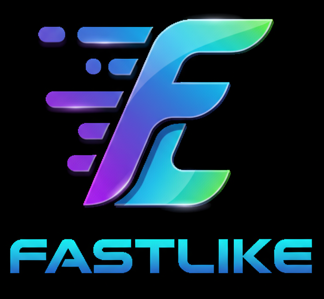

# fastlike

fastlike is a Go implementation of the Fastly Compute@Edge XQD ABI using `wasmtime` and exposes
a `http.Handler` for you to use. It allows you to run Fastly Compute@Edge compatible WebAssembly
programs locally for testing and development purposes.

## Usage

The example proxy implementation in `cmd/fastlike` can be run with:

```
$ go run ./cmd/fastlike -wasm <wasmfile> -backend <proxy address>
```

### Command Line Options

- `-wasm` - Required: path to the WASM program to execute
- `-bind` - Address to bind to (default: localhost:5000)
- `-v` - Verbosity level (0, 1, 2)
- `-backend` or `-b` - Backend addresses (use empty name for catch-all backend)
- `-dictionary` or `-d` - Dictionary files for key-value lookups (JSON format with string values)

### Multiple Backends

You can specify multiple backends using the `-backend` flag multiple times:

```
$ go run ./cmd/fastlike -wasm my-program.wasm -backend api=localhost:8000 -backend static=localhost:8080
```

### Dictionaries

You can provide dictionary files (JSON format) for key-value lookups:

```
$ go run ./cmd/fastlike -wasm my-program.wasm -backend localhost:8000 -dictionary mydict=data.json
```

The dictionary file should contain a JSON object with string keys and values:

```json
{
  "key1": "value1",
  "key2": "value2"
}
```

## Getting WASM Programs

You'll need a Fastly Compute@Edge compatible WASM program to run with fastlike. The simplest
way to do that is via the [fastly cli](https://github.com/fastly/cli) and using one of the [starter
kits](https://developer.fastly.com/solutions/starters/).

After scaffolding your WASM program using a starter kit and modifying it to your liking, you'll need
to build the WASM binary:

```
$ fastly compute init my-compute-project
# answer the prompts, creating a rust or assemblyscript project
$ fastly compute build
```

And then use the resulting WASM binary in fastlike:

```
$ go run ./cmd/fastlike -wasm my-compute-project/bin/main.wasm -backend <proxy address>
```

You don't need the fastly CLI to build the test program either, as long as you have rust installed
and the wasm32-wasip1 target available:

```
# This example is using one of the guest implementations of the spec tests
$ rustup target add wasm32-wasip1 # ensure we have the wasm32-wasip1 for the current toolchain
# The wasm32-wasip1 target is configured as the default target via `specs/testdata/rust/.cargo/config`
$ cd specs/testdata/rust; cargo build; cd ../../..
$ go run ./cmd/fastlike -wasm ./specs/testdata/rust/target/wasm32-wasip1/debug/example.wasm -backend <proxy address>
```

However, using the [fastly cli](https://github.com/fastly/cli) will help ensure your toolchains are
properly up to date and your dependencies are in order.

For a more full-featured example, using the default rust starter kit:

```
# in one terminal:
$ go run ./cmd/fastlike -wasm ./my-compute-project/bin/main.wasm -backend localhost:8000 -bind localhost:5000

# in another
$ python3 -m http.server

# in a third
$ curl localhost:5000/backend
```

Go, running Rust, calling Go, proxying to Python.

## Go Module Information

The module requires Go 1.23 and uses `github.com/bytecodealliance/wasmtime-go v1.0.0` for WASM execution.
